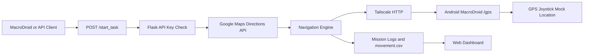

# DigitalTwinGPS

DigitalTwinGPS 是一個以 Flask、Google Maps Directions API、Tailscale P2P 與 Android MacroDroid 組成的 GPS Digital Twin 系統。任務開始後，伺服器會依 Google Maps 規劃路線產生連續 GPS 座標，並透過 Tailscale 傳送到手機端 MacroDroid HTTP Server，讓 Android 裝置的 Mock Location 依任務路線移動。

## 功能

- 任務控制：使用 `/start_task` 開始任務，使用 `/stop_task` 停止伺服器端任務
- GPS 推送：將 `lat` / `lng` 傳送到手機端 MacroDroid `/gps`
- 路線規劃：使用 Google Maps Directions API 取得步行、大眾運輸與機車路線
- 交通模式：支援 `walking`、`transit`、`motorcycle`
- 大眾運輸：`transit_type` 可指定 `AUTO`、`MRT` 或 `BUS`
- 位置維持：任務完成後保持最後位置，直到停止任務
- Location Guardian：定期補送最後座標，維持手機端定位狀態
- 任務歷史：每次任務建立獨立 log session 與 `movement.csv`
- Web 監控：地圖、任務狀態、最後座標、路線、Log 與任務歷史
- Dev Container：只建立開發環境，由使用者在 VS Code 終端機手動啟動程式

## 專案結構

```text
DigitalTwinGPS/
├─ run_server.py
├─ requirements.txt
├─ Caddyfile
├─ README.md
├─ .env.example
├─ DigitalTwinGPS(example).category
├─ .devcontainer/
│  ├─ Dockerfile
│  ├─ docker-compose.yml
│  └─ devcontainer.json
└─ digital_twin/
   ├─ config.py
   ├─ logger.py
   ├─ state.py
   ├─ api/
   ├─ core/
   ├─ data/settings.json
   ├─ static/
   └─ templates/
```

## 系統流程



## 環境設定

建立 Python 環境：

```bash
python -m venv .venv
.venv\Scripts\activate
pip install -r requirements.txt
```

建立 `.env`：

```bash
copy .env.example .env
```

`.env` 範例：

```ini
GOOGLE_MAPS_API_KEY="YOUR_GOOGLE_MAPS_API_KEY"
PC_TAILSCALE_IP="100.x.x.x"
PHONE_TAILSCALE_IP="100.x.x.x"
API_SECRET_KEY="replace_with_a_long_random_secret"
USE_CADDY="false"
FLASK_PORT=5050
TZ="Asia/Taipei"
```

`API_SECRET_KEY` 請使用至少 16 字元以上的隨機字串，MacroDroid 任務控制也需要使用同一組值。

## 啟動

```bash
python run_server.py
```

預設網址：

```text
https://localhost:5050/map
https://<PC_TAILSCALE_IP>:5050/map
```

進入 `/map` 時會導向 `/login`，請輸入 `.env` 中的 `API_SECRET_KEY`。

## Tailscale

PC 與 Android 手機需要登入同一個 Tailscale tailnet。PC 透過手機的 Tailscale IP 呼叫 MacroDroid HTTP Server，手機也可透過 PC 的 Tailscale IP 呼叫任務控制 API。

PC 端設定：

```ini
PC_TAILSCALE_IP="100.x.x.x"
```

手機端設定：

```ini
PHONE_TAILSCALE_IP="100.x.x.x"
```

PC 會送出座標到：

```text
http://<PHONE_TAILSCALE_IP>:8080/gps?lat=25.xxxxxxx&lng=121.xxxxxxx
```

建議只在 Tailscale 或可信任內網使用。若要更完整的 HTTPS 體驗，可使用 Caddy 搭配固定 Tailscale IP 或 MagicDNS。

## Caddy HTTPS

若使用 Caddy 作為 HTTPS 反向代理，將 `.env` 設為：

```ini
USE_CADDY="true"
```

啟動 Flask：

```bash
python run_server.py
```

另一個終端機啟動 Caddy：

```bash
caddy run --config Caddyfile
```

`USE_CADDY=true` 時 Flask 綁定在 `127.0.0.1`，由 Caddy 對外提供 HTTPS。

## Android MacroDroid

專案根目錄提供 `DigitalTwinGPS(example).category`，可匯入 MacroDroid 作為範例分類。匯入後請修改：

- 全域變數 `g_server_url`
- HTTP Request header `X-API-Key`
- MacroDroid HTTP Server port
- GPS Joystick / Mock Location 權限
- HTTPS 憑證信任設定

### Mission Controller

用途：在手機上輸入任務資料，送到 PC 的 `/start_task`。

- Method：`POST`
- URL：`{v=g_server_url}/start_task`
- Header：`X-API-Key: <API_SECRET_KEY>`
- Content-Type：`application/json`

任務 JSON：

```json
{
  "init_loc": "25.047800,121.517000",
  "stops": [
    {
      "name": "Taipei Main Station",
      "coord": "25.047800,121.517000",
      "mode": "transit",
      "transit_type": "MRT",
      "wait_time": "09:30",
      "skip_if_late": true
    }
  ]
}
```

### Smart GPS Agent

用途：手機端接收 PC 傳來的座標，並轉發給 GPS Joystick。

- Method：`GET`
- Port：`8080`
- Path / Identifier：`gps`
- Query params dictionary：`http_params`
- Query params：`lat`、`lng`

呼叫格式：

```text
http://<PHONE_TAILSCALE_IP>:8080/gps?lat=25.xxxxxxx&lng=121.xxxxxxx
```

### Stop GPS

用途：從手機呼叫 PC 的 `/stop_task`，停止伺服器端任務。

- Method：`GET` 或 `POST`
- URL：`{v=g_server_url}/stop_task`
- Header：`X-API-Key: <API_SECRET_KEY>`

手機端會停留在最後一次收到的 Mock Location。

## 任務 API

任務控制 API 必須帶入：

```http
X-API-Key: <API_SECRET_KEY>
Content-Type: application/json
```

### 開始任務

```http
POST /start_task
```

欄位說明：

| 欄位 | 必填 | 說明 |
|---|---:|---|
| `init_loc` | 是 | 初始座標，格式為 `lat,lng` |
| `stops` | 是 | 任務站點陣列，至少 1 筆，最多 50 筆 |
| `stops[].name` | 是 | Google Maps 可辨識的地名或地址 |
| `stops[].mode` | 是 | `walking`、`transit`、`motorcycle` |
| `stops[].transit_type` | 否 | `AUTO`、`MRT`、`BUS` 或空字串，只有 `transit` 使用 |
| `stops[].wait_time` | 否 | `HH:MM`，出發前等待時間 |
| `stops[].skip_if_late` | 否 | 若已超過等待時間，是否略過等待 |
| `stops[].coord` | 否 | 最終精準對位座標，格式為 `lat,lng` |

### 停止任務

```http
GET /stop_task
POST /stop_task
```

## Web 監控

```text
https://localhost:5050/map
```

網頁可查看：

- 任務狀態：`idle`、`running`、`holding`、`aborted`、`failed`
- 任務 generation
- 已完成站點 / 總站點
- 目前目標
- 最後送出的座標
- Tailscale P2P 目標
- 速度倍率與 Guardian 間隔
- Google Maps 規劃路線
- 即時 movement CSV
- 系統、路線、錯誤、安全 log
- 任務歷史列表

網頁不顯示電腦硬體資訊。

## 監控 API

監控 API 可使用登入 session 或 `X-API-Key`。

| API | 說明 |
|---|---|
| `GET /api/system_status` | 任務狀態、最後座標、P2P 目標、設定、log session |
| `GET /api/planned_route` | 目前規劃路線座標 |
| `GET /api/csv?start_line=N` | 讀取目前任務的 movement CSV |
| `GET /api/log/all` | 目前任務完整 log |
| `GET /api/log/route` | 路線 log |
| `GET /api/log/error` | warning / error log |
| `GET /api/log/security` | 安全事件 log |
| `GET /api/mission` | 目前任務資料 |
| `GET /api/history` | 任務歷史列表 |
| `GET /api/history/<date>/<session>/csv` | 歷史任務 CSV |
| `GET /api/history/<date>/<session>/log/<log_name>` | 歷史任務 log |

## Log 系統

常駐 log：

```text
logs/server.log
logs/security.log
```

每次任務會建立獨立 session：

```text
logs/YYYY-MM-DD/HH-MM-SS/
├─ all.log
├─ route.log
├─ error.log
├─ security.log
├─ mission.json
└─ movement.csv
```

`movement.csv` 欄位：

```csv
Timestamp,Latitude,Longitude,Action,Note
```

## `settings.json`

設定檔位置：

```text
digital_twin/data/settings.json
```

主要設定：

| 設定 | 預設 | 說明 |
|---|---:|---|
| `SPEED_MULTIPLIER` | `1` | 速度倍率，值越大移動越快 |
| `GUARD_INTERVAL` | `1.5` | Guardian 檢查間隔 |
| `mrt_station_groups` | 分組站點資料 | 依路線整理的台北捷運站座標 |

程式啟動時會自動將 `mrt_station_groups` 攤平成內部使用的 MRT 到站偵測資料庫。

## Dev Container

VS Code 可透過 `.devcontainer` 建立開發環境。此專案不會在背景自動啟動 Docker 服務或 Flask 程式。

Docker Compose project 名稱為 `digitaltwingps`，服務名稱為 `run-server`。容器啟動後會保持待機，直到你在 VS Code Dev Container 終端機手動執行：

```bash
python run_server.py
```

停止 Dev Container 或關閉對應容器時，Compose 會停止 `digitaltwingps` 底下的容器。

## 資訊安全

- 任務控制 API 必須使用 `X-API-Key`
- Web dashboard 需登入或使用有效 API key
- API key 使用 constant-time comparison
- Flask session cookie 設定 `HttpOnly`、`SameSite=Strict`、`Secure`
- Log 不記錄 API key
- Response 加入安全標頭：
  - `X-Content-Type-Options: nosniff`
  - `X-Frame-Options: DENY`
  - `Referrer-Policy: no-referrer`
  - `Cache-Control: no-store`
- 建議只在 Tailscale 或可信任網路中使用

## GitHub 上傳前檢查

可上傳的範例與設定：

- `.env.example`
- `DigitalTwinGPS(example).category`
- `.devcontainer/`
- `digital_twin/data/settings.json`

不應上傳的本機資料：

- `.env`
- `logs/`
- `*.log`
- `*.csv`
- `.venv/`
- IDE 本機設定

## 疑難排解

| 問題 | 檢查項目 |
|---|---|
| 無法啟動伺服器 | 檢查 `.env` 是否存在，`API_SECRET_KEY` 是否已設定 |
| Google Maps 沒有路線 | 檢查 `GOOGLE_MAPS_API_KEY` 與 Directions API 是否啟用 |
| 手機沒收到座標 | 檢查 Tailscale、`PHONE_TAILSCALE_IP`、MacroDroid `/gps`、手機防火牆 |
| MacroDroid 任務送出失敗 | 檢查 `g_server_url`、`X-API-Key`、HTTPS 憑證設定 |
| `/api/*` 回傳 401 | 重新登入 `/login` 或確認 `X-API-Key` |
| 地圖空白 | 檢查網路、Leaflet/CDN、瀏覽器 console |
| 沒有歷史 CSV | 確認任務已開始，並檢查 `logs/YYYY-MM-DD/HH-MM-SS/` |

## 驗證指令

```bash
python -m py_compile run_server.py digital_twin/__init__.py digital_twin/config.py digital_twin/logger.py digital_twin/state.py digital_twin/api/middleware.py digital_twin/api/routes.py digital_twin/core/navigation.py
```

## 授權

本專案採用 MIT License，詳細內容請見 [LICENSE](LICENSE)。

## 作者

Yang Sheng-Wen

[https://github.com/YangShengWen-0505](https://github.com/YangShengWen-0505)
